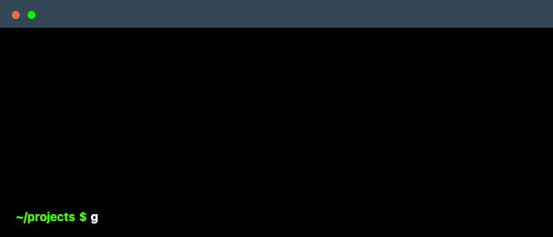

    

### Main skills

### Recent contributions

- [Guiziweb/mcp-project-management](https://github.com/Guiziweb/mcp-project-management) `today`
- [Guiziweb/guiziweb-plugins](https://github.com/Guiziweb/guiziweb-plugins) Claude Code plugins for Sylius development `5 days ago`
- [Sylius/McpServerPlugin](https://github.com/Sylius/McpServerPlugin) `2 weeks ago`
- [symfony/recipes-contrib](https://github.com/symfony/recipes-contrib) Symfony Contrib Recipes Repositories `2 weeks ago`
- [symfony/ai](https://github.com/symfony/ai) Symfony AI is a set of components that integrate AI capabilities into PHP applications `2 months ago`
- [acseo/TypesenseBundle](https://github.com/acseo/TypesenseBundle) Typesense PHP integration for your Symfony project `2 months ago`
- [Sylius/PluginSkeleton](https://github.com/Sylius/PluginSkeleton) Skeleton app for Sylius plugin development `2 months ago`
- [modelcontextprotocol/php-sdk](https://github.com/modelcontextprotocol/php-sdk) The official PHP SDK for Model Context Protocol servers and clients. Maintained in collaboration with The PHP Foundation. `3 months ago`
- [jolicode/MediaBundle](https://github.com/jolicode/MediaBundle) 🖼️ A media management bundle for Symfony applications, with Easyadmin and SonataAdmin integrations `3 months ago`
- [BitBagCommerce/SyliusCmsPlugin](https://github.com/BitBagCommerce/SyliusCmsPlugin) Content management system for eCommerce apps created on Sylius platform. Built with Sylius code quality, flexibility, BDD. `11 months ago`
- [Sylius/Sylius](https://github.com/Sylius/Sylius) Headless open-source eCommerce platform on top of PHP/Symfony/API Platform `11 months ago`
- [acseo/SyliusPrometheusMetricsPlugin](https://github.com/acseo/SyliusPrometheusMetricsPlugin) `11 months ago`

### Recent pull requests

- [Add sylius/mcp-server-plugin 0.2 recipe](https://github.com/symfony/recipes-contrib/pull/1930) on **symfony/recipes-contrib** (merged)
- [ [TwigHooks] Add debug command to display hooks and hookables](https://github.com/Sylius/Stack/pull/326) on **Sylius/Stack** (open)
- [Migrate to symfony/mcp-bundle](https://github.com/Sylius/McpServerPlugin/pull/4) on **Sylius/McpServerPlugin** (merged)
- [[AI Bundle] Fix PHPDoc type for collected platform call data](https://github.com/symfony/ai/pull/1177) on **symfony/ai** (merged)
- [[AI Bundle] Fix profiler serialization error with unconsumed streams](https://github.com/symfony/ai/pull/1176) on **symfony/ai** (merged)
- [[Chat] Fix MongoDB identifier context in MessageNormalizer denormalize](https://github.com/symfony/ai/pull/1145) on **symfony/ai** (merged)
- [[AI Bundle] Make expression_language service optional](https://github.com/symfony/ai/pull/1131) on **symfony/ai** (merged)
- [[Platform] Remove unused code in Vector constructor and add missing tests](https://github.com/symfony/ai/pull/1130) on **symfony/ai** (merged)
- [[Agent] Enable remote MCP tools for agents](https://github.com/symfony/ai/pull/1129) on **symfony/ai** (open)
- [[AI Bundle] Display tool JSON schema in profiler Platform Calls](https://github.com/symfony/ai/pull/1105) on **symfony/ai** (merged)
- [feat: add collection_field option and restore Doctrine 2.x support](https://github.com/acseo/TypesenseBundle/pull/144) on **acseo/TypesenseBundle** (merged)
- [Update acseo_typesense.yaml](https://github.com/symfony/recipes-contrib/pull/1899) on **symfony/recipes-contrib** (merged)
- [[Store] Add metadata filtering support to `InMemoryStore` and `CacheStore`](https://github.com/symfony/ai/pull/880) on **symfony/ai** (merged)
- [Fix: Sanitize cache keys to avoid reserved characters validation error](https://github.com/jolicode/MediaBundle/pull/39) on **jolicode/MediaBundle** (merged)
- [Make logger nullable in Transport constructors](https://github.com/modelcontextprotocol/php-sdk/pull/152) on **modelcontextprotocol/php-sdk** (merged)
- [[MCP Bundle] Add MCP profiler support to display server capabilities](https://github.com/symfony/ai/pull/866) on **symfony/ai** (merged)
- [[MCP Bundle] Make MonologBundle optional](https://github.com/symfony/ai/pull/864) on **symfony/ai** (merged)
- [[Store] Fix CacheStore and InMemoryStore to return similarity scores](https://github.com/symfony/ai/pull/856) on **symfony/ai** (merged)
- [Add plugin rename script ](https://github.com/Sylius/PluginSkeleton/pull/479) on **Sylius/PluginSkeleton** (merged)
- [Add Gemini 2.0 Flash Thinking model support](https://github.com/locus-technologies/agentic-commerce-protocol-demo/pull/5) on **locus-technologies/agentic-commerce-protocol-demo** (open)
- [[MCP Bundle] Fix dependency injection and method-based / invokable support](https://github.com/symfony/ai/pull/757) on **symfony/ai** (merged)

### Connect with me!

