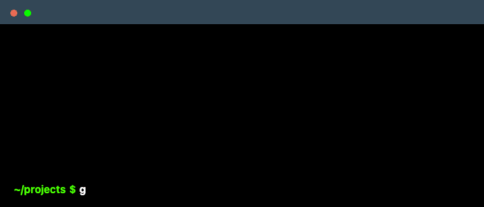

    

### Main skills

### Recent contributions

- [Guiziweb/sylius-migration-demo](https://github.com/Guiziweb/sylius-migration-demo) `5 days ago`
- [acseo/SyliusPrometheusMetricsPlugin](https://github.com/acseo/SyliusPrometheusMetricsPlugin) `1 week ago`
- [Guiziweb/guiziweb-plugins](https://github.com/Guiziweb/guiziweb-plugins) Claude Code plugins for Sylius development `1 week ago`
- [Sylius/Stack](https://github.com/Sylius/Stack) The Sylius stack is a set of tools for your Symfony projects. `1 month ago`
- [Guiziweb/mcp-project-management](https://github.com/Guiziweb/mcp-project-management) `1 month ago`
- [Sylius/McpServerPlugin](https://github.com/Sylius/McpServerPlugin) `1 month ago`
- [symfony/recipes-contrib](https://github.com/symfony/recipes-contrib) Symfony Contrib Recipes Repositories `1 month ago`
- [symfony/ai](https://github.com/symfony/ai) Symfony AI is a set of components that integrate AI capabilities into PHP applications `3 months ago`
- [acseo/TypesenseBundle](https://github.com/acseo/TypesenseBundle) Typesense PHP integration for your Symfony project `3 months ago`
- [Sylius/PluginSkeleton](https://github.com/Sylius/PluginSkeleton) Skeleton app for Sylius plugin development `3 months ago`
- [modelcontextprotocol/php-sdk](https://github.com/modelcontextprotocol/php-sdk) The official PHP SDK for Model Context Protocol servers and clients. Maintained in collaboration with The PHP Foundation. `4 months ago`
- [jolicode/MediaBundle](https://github.com/jolicode/MediaBundle) 🖼️ A media management bundle for Symfony applications, with Easyadmin and SonataAdmin integrations `4 months ago`
- [BitBagCommerce/SyliusCmsPlugin](https://github.com/BitBagCommerce/SyliusCmsPlugin) Content management system for eCommerce apps created on Sylius platform. Built with Sylius code quality, flexibility, BDD. `1 year ago`
- [Sylius/Sylius](https://github.com/Sylius/Sylius) Headless open-source eCommerce platform on top of PHP/Symfony/API Platform `1 year ago`

### Recent pull requests
 
- [ [Bug] fix: use withFields and withFilters instead of addFields and addFilters in make:grid skeleton](https://github.com/Sylius/SyliusGridBundle/pull/477) on **Sylius/SyliusGridBundle** (open) 
- [[BootstrapAdminUi] fix breadcrumbs template crashing when configuration.title is not set      ](https://github.com/Sylius/Stack/pull/355) on **Sylius/Stack** (open) 
- [feat: implement dark mode support](https://github.com/Sylius/Stack/pull/353) on **Sylius/Stack** (open) 
- [camilleislasse (single thread)](https://github.com/tempestphp/100-million-row-challenge/pull/197) on **tempestphp/100-million-row-challenge** (open) 
- [ camilleislasse](https://github.com/tempestphp/100-million-row-challenge/pull/31) on **tempestphp/100-million-row-challenge** (open) 
- [Add sylius/mcp-server-plugin 0.2 recipe](https://github.com/symfony/recipes-contrib/pull/1930) on **symfony/recipes-contrib** (merged) 
- [ [TwigHooks] Add debug command to display hooks and hookables](https://github.com/Sylius/Stack/pull/326) on **Sylius/Stack** (merged)  

### Connect with me!

